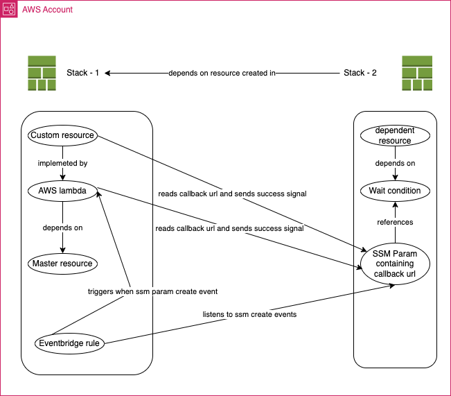

# Showcase for coordinating dependencies between stacks deployed independently.

This particular example repository has 3 stacks:
 - StackDependencyStack (main stack)
 - DependentStack1 (depends on StackDependencyStack)
 - DependentStack2 (depends on StackDependencyStack)

The stacks are using construct `InterStackDependence` which is located under `./lib/inter-stack-dependence.ts`.

The construct takes property *dependenceType* and creates a dependent or dependee stack based on that.

To deply the stack, run the following commands:
```
npm ci
npm run cdk deploy <STACK-NAME>
```

